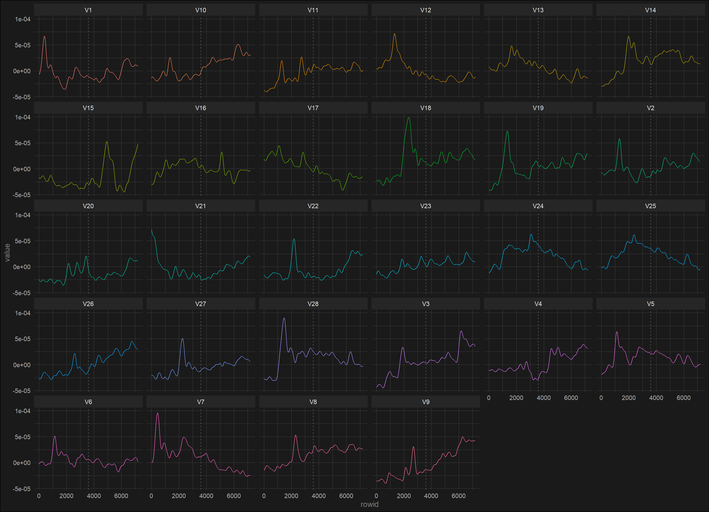
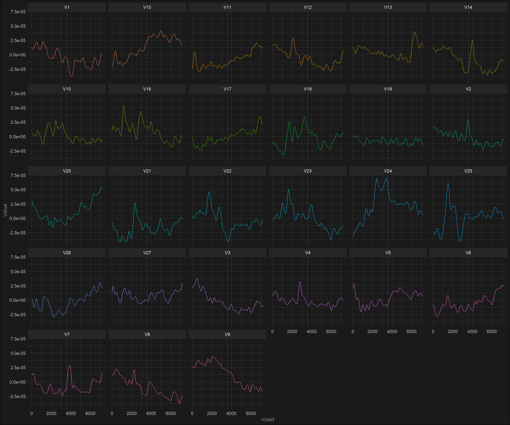
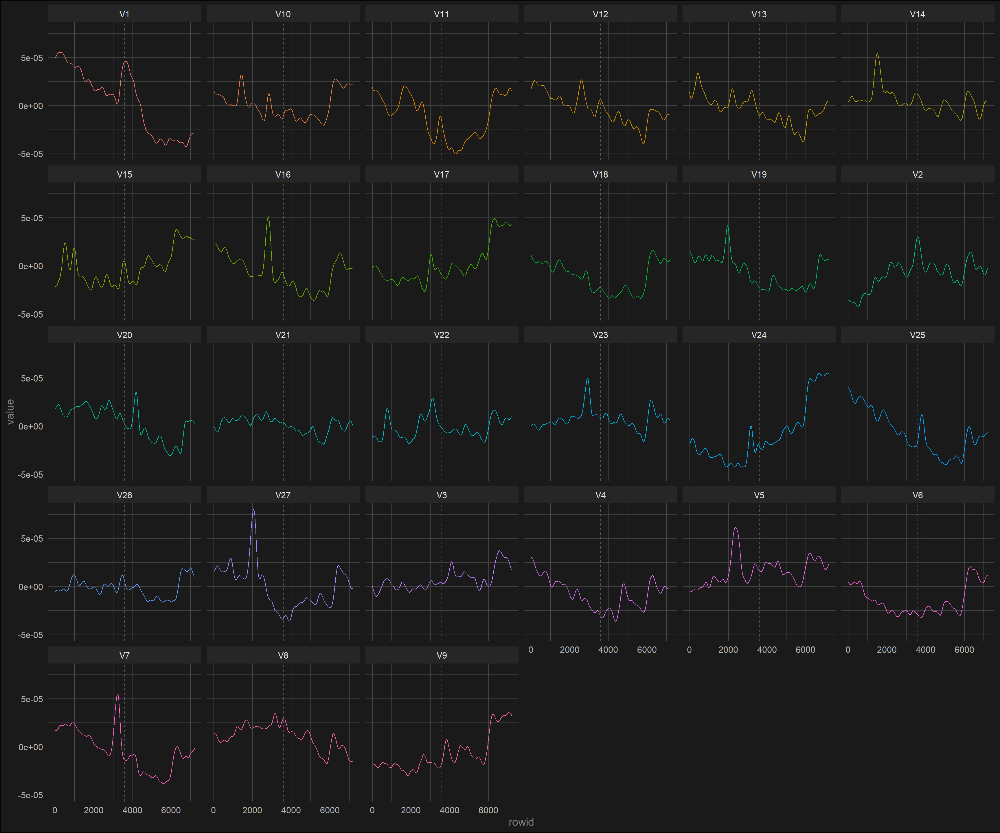
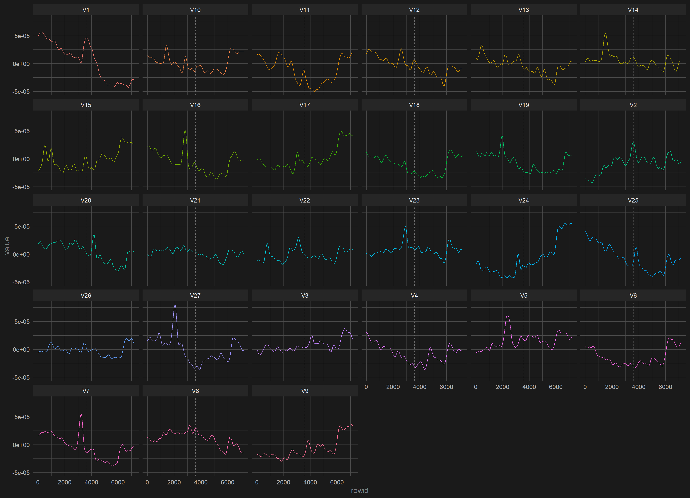

## Setup


## Import data

```r
close <-
  read_excel(here("data", "close_c3.xlsx"), col_names = FALSE) %>%
  t() %>%
  as_tibble()


mouth <-
  read_excel(here("data", "mouth_c3.xlsx"), col_names = FALSE) %>%
  t() %>%
  as_tibble()

reach <-
  read_excel(here("data", "reach_c3.xlsx"), col_names = FALSE) %>%
  t() %>%
  as_tibble()
```

## Plot all trials

```r
close %>%
  rowid_to_column() %>%
  pivot_longer(-rowid, names_to = "trial_number", values_to = "value") %>%
  ggplot(aes(rowid, value, color = trial_number)) +
  geom_line(show.legend = FALSE) +
  geom_vline(xintercept = 3600, lty = 2, color = "grey40") +
  facet_wrap(~trial_number)
```

<!-- -->

```r
mouth %>%
  rowid_to_column() %>%
  pivot_longer(-rowid, names_to = "trial_number", values_to = "value") %>%
  ggplot(aes(rowid, value, color = trial_number)) +
  geom_line(show.legend = FALSE) +
  geom_vline(xintercept = 3600, lty = 2, color = "grey40") +
  facet_wrap(~trial_number)
```

<!-- -->

```r
reach %>%
  rowid_to_column() %>%
  pivot_longer(-rowid, names_to = "trial_number", values_to = "value") %>%
  ggplot(aes(rowid, value, color = trial_number)) +
  geom_line(show.legend = FALSE) +
  geom_vline(xintercept = 3600, lty = 2, color = "grey40") +
  facet_wrap(~trial_number)
```

<!-- -->

## Decide on good and bad candidates

```r
close_good <-
  c("V1", "V3", "V4", "V5", "V6", "V8", "V9", "V13", "V14", "V16", "V17", "V20", "V22", "V24", "V28")

mouth_good <-
  c("V1", "V3", "V4", "V6", "V8", "V9", "V12", "V13", "V14", "V17", "V19", "V20", "V22", "V24", "V25", "V26")

reach_good <-
  c("V2", "V3", "V4", "V5", "V7", "V8", "V9", "V10", "V11", "V12", "V13", "V14", "V15", "V16", "V17", "V20", "V21", "V22", "V23", "V25", "V26")
```

## Plot average of good candidates vs average of all trials

```r
p1 <-
  close %>%
  # slice(3601:7200) %>%
  rowwise() %>%
  summarise(
    mean = mean(V1:V28),
    mean_good = mean(c(V1, V3:V6, V8, V9, V13, V14, V16, V17, V20, V22, V24, V28)),
    mean_bad = mean(c(V2, V7, V10:V12, V15, V18, V19, V21, V23, V25:V27))
  ) %>%
  rowid_to_column("time") %>%
  pivot_longer(-time) %>%
  mutate(name = factor(name)) %>%
  ggplot(aes(time, value, group = name, color = name)) +
  geom_line() +
  geom_vline(xintercept = 3600, lty = 2, color = "grey40", size = 1.3) +
  labs(
    title = "Average of all close-trials",
    x = NULL,
    y = "Microvolts (mV)",
    color = NULL
  ) +
  scale_color_manual(labels = c("All trials", "Bad trials", "Good trials"), values = c("#cac1d5", "#d33348", "#78b21b"))

p2 <-
  mouth %>%
  # slice(3601:7200) %>%
  rowwise() %>%
  summarise(
    mean = mean(V1:V27),
    mean_good = mean(c(V1, V3:V4, V6, V8:V9, V12:V14, V17, V19:V20, V22, V24:V26)),
    mean_bad = mean(c(V2, V5, V7, V10:V11, V15:V16, V18, V21, V23, V27))
  ) %>%
  rowid_to_column("time") %>%
  pivot_longer(-time) %>%
  mutate(name = factor(name)) %>%
  ggplot(aes(time, value, group = name, color = name)) +
  geom_line() +
  geom_vline(xintercept = 3600, lty = 2, color = "grey40", size = 1.3) +
  labs(
    title = "Average of all mouth-trials",
    x = NULL,
    y = "Microvolts (mV)",
    color = NULL
  ) +
  scale_color_manual(labels = c("All trials", "Bad trials", "Good trials"), values = c("#cac1d5", "#d33348", "#78b21b")) 

p3 <-
  reach %>%
  # slice(3601:7200) %>%
  rowwise() %>%
  summarise(
    mean = mean(V1:V27),
    mean_good = mean(c(V1, V3:V4, V6, V8:V9, V12:V14, V17, V19:V20, V22, V24:V26)),
    mean_bad = mean(c(V2, V5, V7, V10:V11, V15:V16, V18, V21, V23, V27))
  ) %>%
  rowid_to_column("time") %>%
  pivot_longer(-time) %>%
  mutate(name = factor(name)) %>%
  ggplot(aes(time, value, group = name, color = name)) +
  geom_line() +
  geom_vline(xintercept = 3600, lty = 2, color = "grey40", size = 1.3) +
  labs(
    title = "Average of all reach-trials",
    x = NULL,
    y = "Microvolts (mV)",
    color = NULL
  ) +
  scale_color_manual(labels = c("All trials", "Bad trials", "Good trials"), values = c("#cac1d5", "#d33348", "#78b21b"))

(p1 / p2 / p3) + plot_layout(guides = "collect") &
  theme(legend.position = "bottom")
```

<!-- -->

## Extract features


